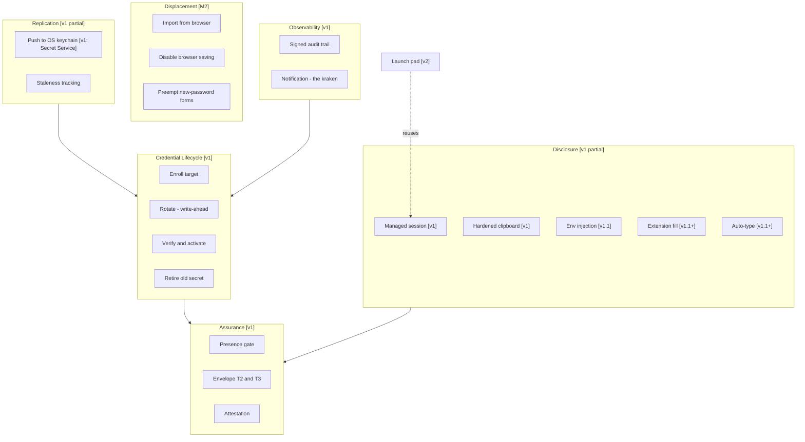
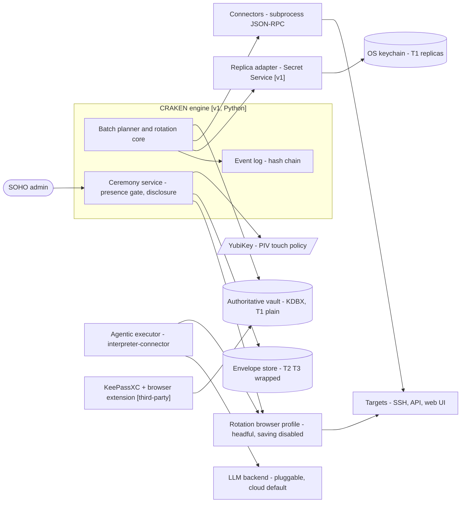
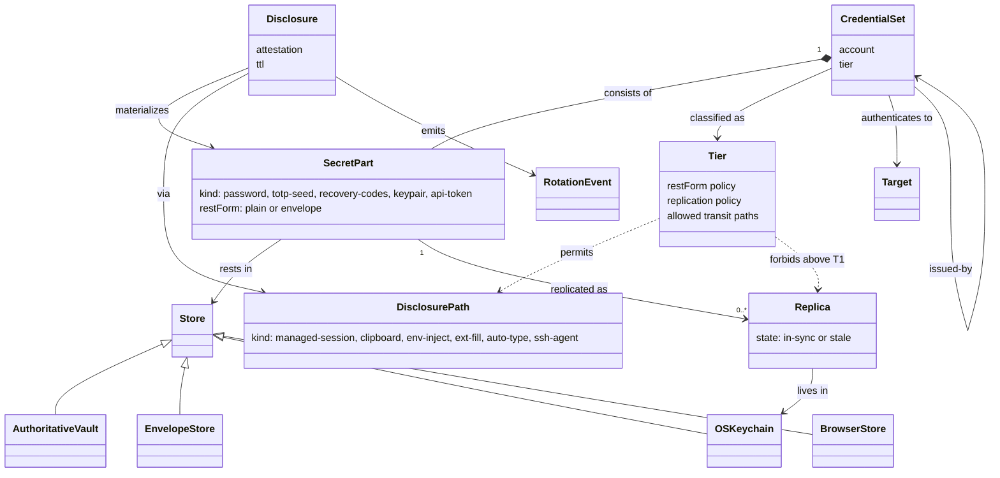
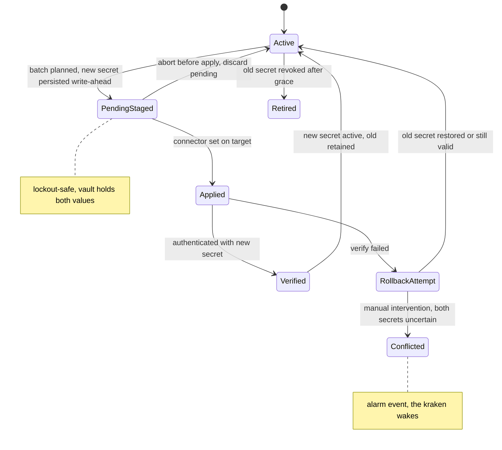
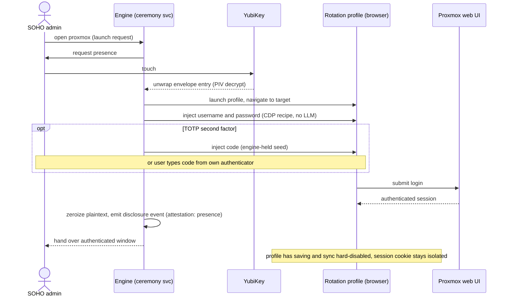

# CRAKEN — Model Views (draft)

*Draft views for the design grilling, 2026-07-19. Notation: Mermaid throughout (renders natively on GitHub, zero toolchain). The durable architecture-description tooling (LikeC4 semantic model + layout snapshots, PlantUML for behavior — per the lobotom-y metamodel) is a pending adoption decision; these drafts are written to port 1:1 when that lands. Status tags follow the lobotom-y vocabulary: `v1` (committed), `v1.1+`, `v2`, `parked`.*

Terms are used per [CONTEXT.md](../../CONTEXT.md); decisions per [docs/adr/](../adr/).

---

## V1 — Capability map

Capabilities structure the spec and roadmap; each maps to spec chapters and engine components. (Whether the capability layer becomes a normative model element kind is an open grilling question.)

## V2 — Container view (C4 level 2, simplified)

Trust-boundary notes: secrets cross engine↔connector via stdio pipe only; the LLM backend receives placeholders and redacted DOM, never secrets; the ecosystem (KeePassXC + extension) reads T1 only — envelope entries are opaque to it.

## V3 — Domain class model (below the C4 floor)

The three policy-typed relationship families — **rest** (SecretPart→Store), **replication** (SecretPart→Replica), **transit** (Disclosure→DisclosurePath) — are each constrained by the credential set's Tier. That is the modeling answer to "how do we model storage, replication policy and transit path": tier as a policy object typing three association families, enforced at runtime and asserted in the spec.

Notes:
- **BrowserStore** appears only as a displacement source (import) — never a rest or replica store (ADR-0015).
- **`issued-by`** models the authority chain: self-provisioned sets root in registration-time secrets (recovery codes, registered authenticator — the true T3 of the set); delegated credentials (enterprise-provisioned accounts, PATs) point to the parent credential that can re-issue them. Blast radius flows along `issued-by` edges; T3 = a node with inbound `issued-by` edges from other sets.
- **MFA artifacts are SecretParts**, not separate credentials: a TOTP seed or recovery-code block belongs to the set, with its own restForm and (potentially stricter) disclosure policy.

## V4 — Secret rotation lifecycle (state machine)

Replica sub-lifecycle (per replica, T1 only): `in-sync → stale` on rotation commit; `stale → in-sync` on adapter push; staleness emits events consumed by notification.

## V5 — Ceremonial disclosure via managed session (sequence, T3 example: Proxmox)

## V6 — Tier policy matrix (the normative table behind V3)

| Tier | Rest form | Replication | Permitted transit paths | Fill visibility |
|---|---|---|---|---|
| T1 standard | plain KDBX entry | OS keychains via adapters | ecosystem autofill, all disclosure paths | silent fill allowed |
| T2 high | envelope entry | none | managed session (preferred), hardened clipboard, env injection, extension fill (v1.1+), auto-type (KVM/RDP) | explicit ceremony per use |
| T3 privileged | envelope entry | none | managed session only; ssh-agent with confirm-per-use for keys | user never sees or handles plaintext |

Recovery codes and other registration-time root secrets: T3, disclosure = break-glass ceremony only (proposed; pending grilling).
