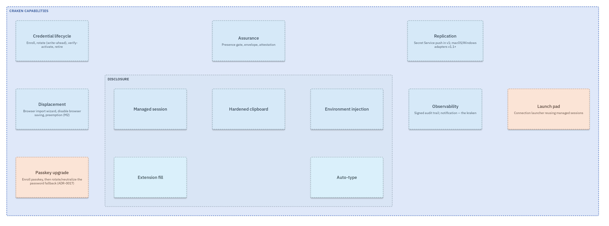
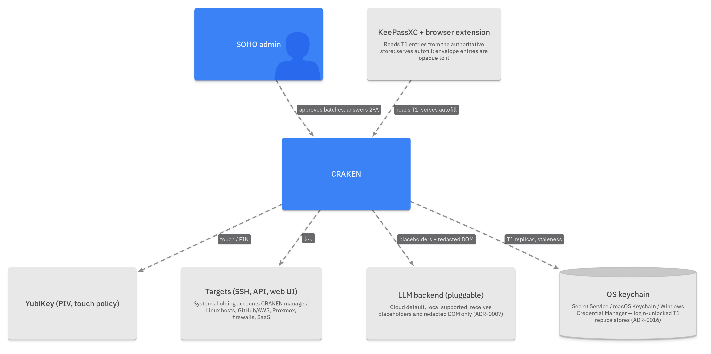
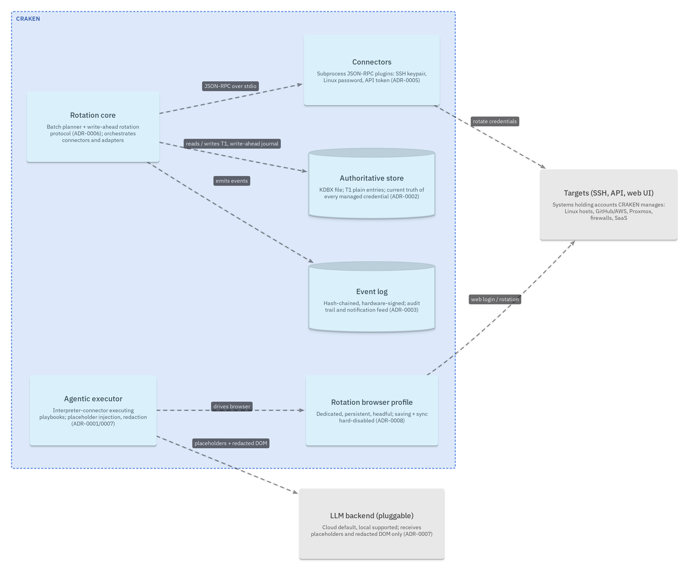
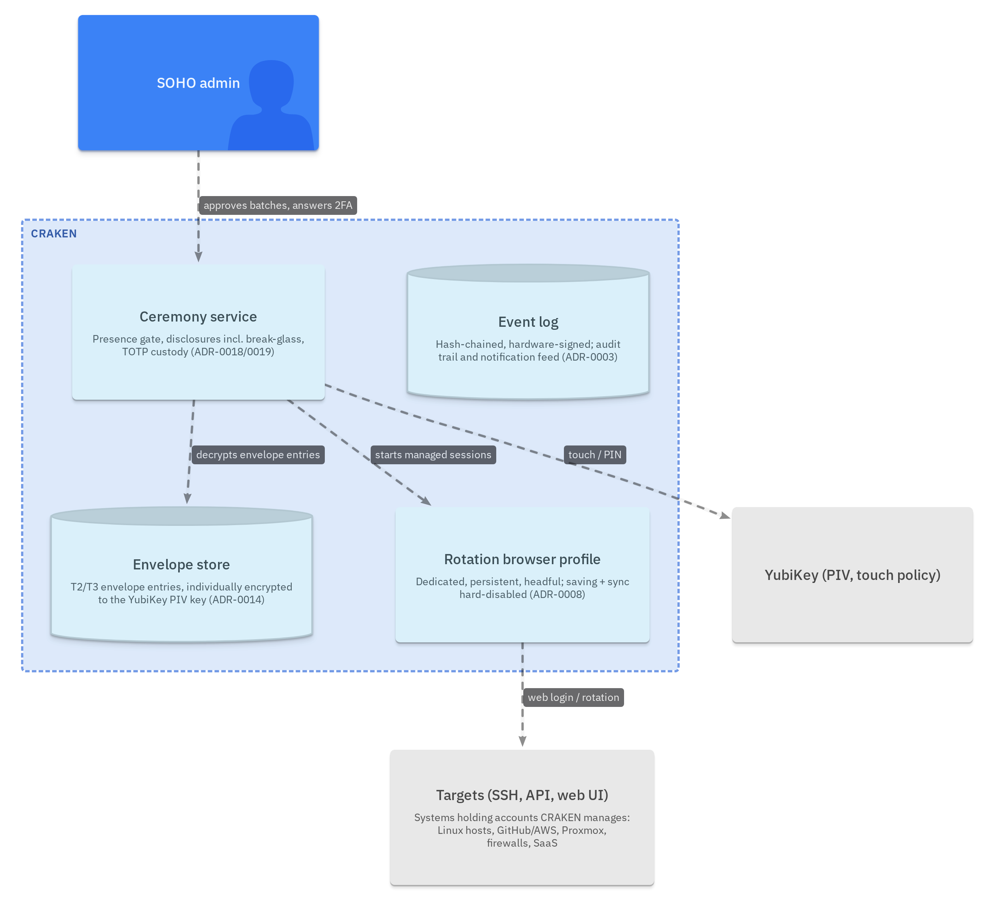
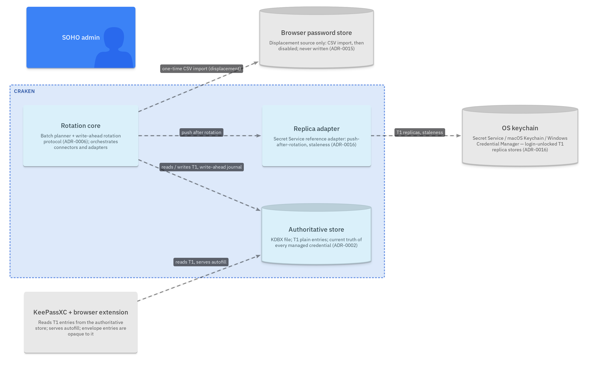
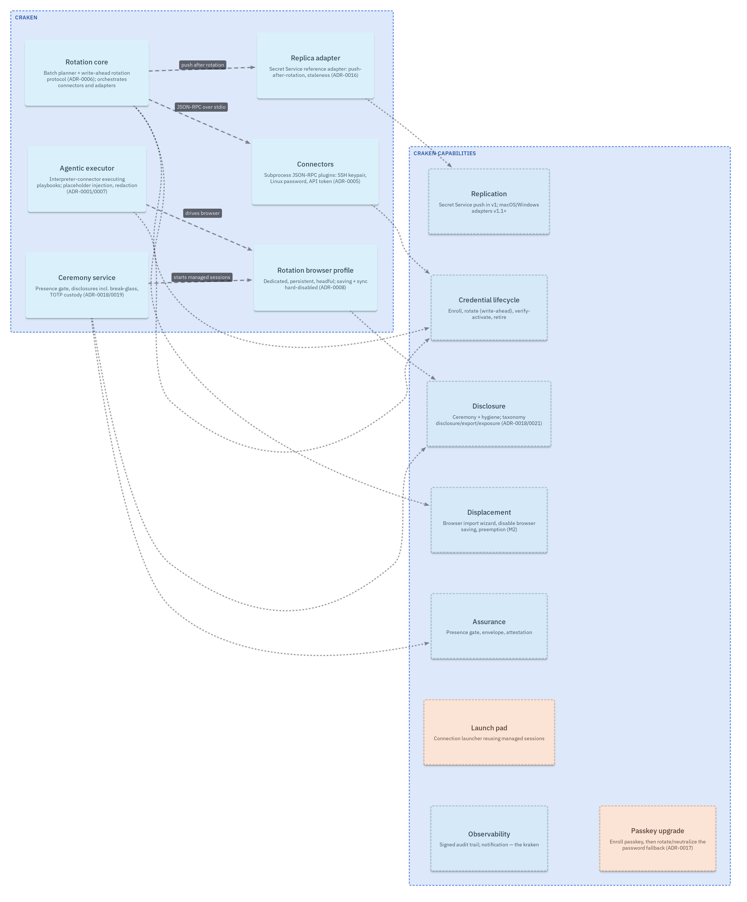
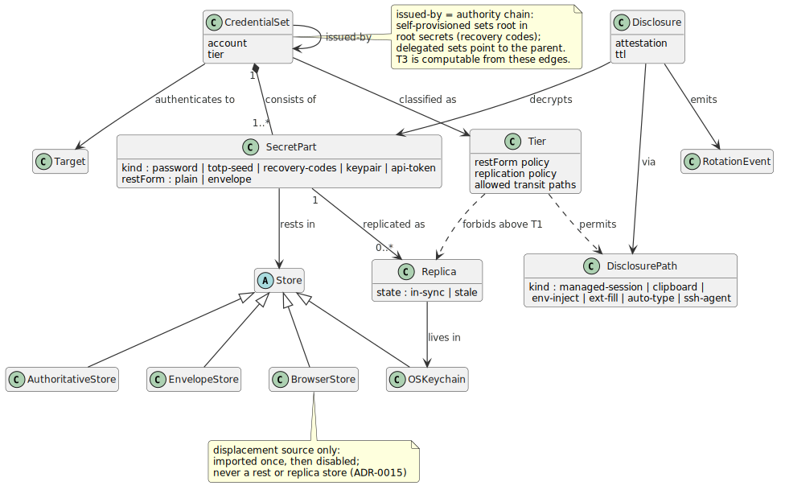
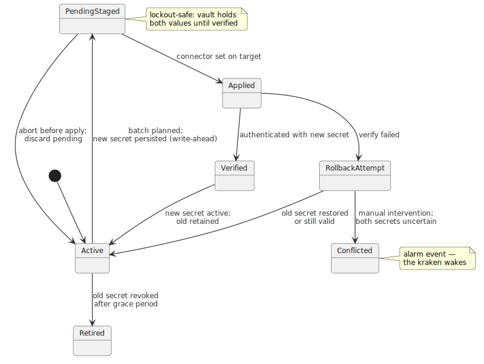
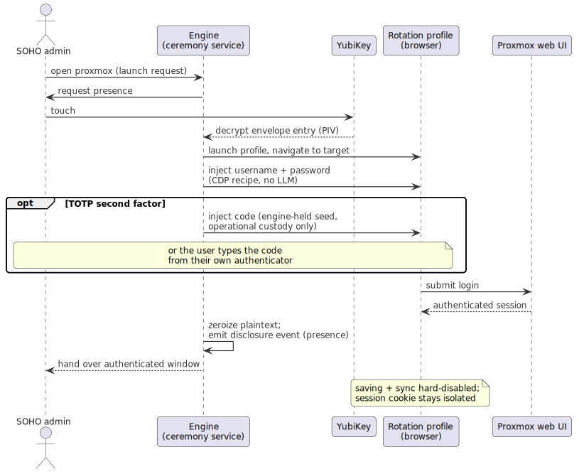

# CRAKEN — Model Views

*Two-layer architecture description per [metamodel.md](metamodel.md) (lobotom-y ADR-0042 pattern): structural views live in the LikeC4 semantic model under [likec4/](likec4/) (agent-owned `*.c4`; human-owned layout snapshots under `likec4/.likec4/`), behavioral/detail views in PlantUML (`*.puml`). All images are derived — regenerate with `scripts/render-diagrams.sh`; never edit them.*

**Layout pass (human):** open `docs/model/likec4/` in VSCode with the LikeC4 extension, open a view preview, click **Edit** in the diagram toolbar (dragging in read-only mode only pans), drag nodes, save — a `.likec4/<view>.likec4.snap` sidecar appears; commit it. Model edits afterwards keep your positions; re-sync on the editor's drift indicator. Until a view has its snapshot, exports use auto-layout.

**Tag legend** — status: `built` implemented+verified · `partial` incomplete · `proposed` designed, not implemented · `deferred` out of scope for now · `third-party` not ours. Roadmap (capabilities): `v1` · `v1-1` (= v1.1+) · `v2` · `parked`. All CRAKEN components are currently `proposed` — the repo has no code yet.

Terms per [CONTEXT.md](../../CONTEXT.md); decisions per [docs/adr/](../adr/).

---

## V1 — Capability map (LikeC4: `capabilities`)

Normative element kind per [ADR-0020](../adr/0020-capability-element-kind.md); roadmap tags carry PRD staging.

## V2 — Structural views (LikeC4)

Four small scoped projections of the one model replace the former single container diagram — compactness by scoping, then by the layout pass.

### Context

### Rotation flow

### Disclosure & assurance

### Store coexistence

### Component → capability traceability

Trust-boundary notes: secrets cross engine↔connector via stdio pipe only; the LLM backend receives placeholders and redacted DOM, never secrets; the ecosystem (KeePassXC + extension) reads T1 only — envelope entries are opaque to it.

## V3 — Domain class model (PlantUML: [data-model.puml](data-model.puml))

The three policy-typed association families — **rests-in**, **replicated-as**, **disclosed-via** — are each constrained by the Tier policy object. Normative pair with the V6 matrix below (sync rule 2).

## V4 — Secret rotation lifecycle (PlantUML: [lifecycle.puml](lifecycle.puml))

Write-ahead protocol per [ADR-0006](../adr/0006-write-ahead-rotation-protocol.md). Replica sub-lifecycle (T1 only): `in-sync → stale` on rotation commit; `stale → in-sync` on adapter push.

## V5 — Ceremonial disclosure via managed session (PlantUML: [seq-managed-session.puml](seq-managed-session.puml))

T3 example: Proxmox. Ceremony + hygiene per [ADR-0018](../adr/0018-ceremonial-disclosure-paths.md)/[0021](../adr/0021-exposure-queues-rotation.md).

## V6 — Tier policy matrix (the normative table behind V3)

| Tier | Rest form | Replication | Permitted transit paths | Fill visibility |
|---|---|---|---|---|
| T1 standard | plain KDBX entry | OS keychains via adapters | ecosystem autofill, all disclosure paths | silent fill allowed |
| T2 high | envelope entry | none | managed session (preferred), hardened clipboard, env injection, extension fill (v1.1+), auto-type (KVM/RDP) | explicit ceremony per use |
| T3 privileged | envelope entry | none | managed session only; ssh-agent with confirm-per-use for keys | user never sees or handles plaintext |

Root secrets (recovery codes, registered authenticators) and break-glass accounts: T3, break-glass disclosure only — full ceremony plus reason capture, alarm event on every use (locked, [ADR-0018](../adr/0018-ceremonial-disclosure-paths.md)).
